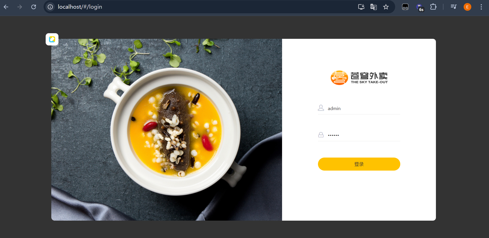
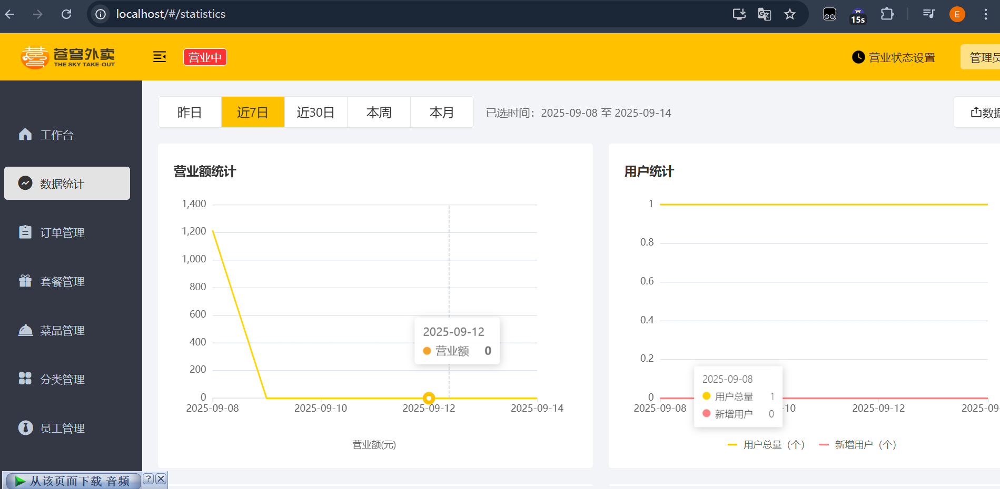

# 黑马程序员苍穹外卖Java后端项目

1. 项目概要与需求背景：本项目是最适合新手的SpringBoot+SSM的企业级Java项目实战项目、是一个为餐饮商家辅助实现点餐管理、数据分析、以及微信小程序的综合案例
2. 运行环境：jdk1.7、maven管理
3. 数据库：使用MySQL：3306端口，请运行数据库/sky.sql生成sky-out数据库表并在IDEA测试连接
4. Redis：6379端口，使用DB01
5. 后端启动：自行编写/sky-server/src/main/resources/application-dev.yml配置文件、包括阿里云oss对象存储、百度API等，在application.yml使用${ }包起来的
6. 前端：直接点击前端运行环境/nginx.exe，在80端口运行
7. 微信小程序：导入微信小程序到微信开发者工具、由于没有商户号，这里修改逻辑跳过支付程序
8. 项目运行示例：
9. 

